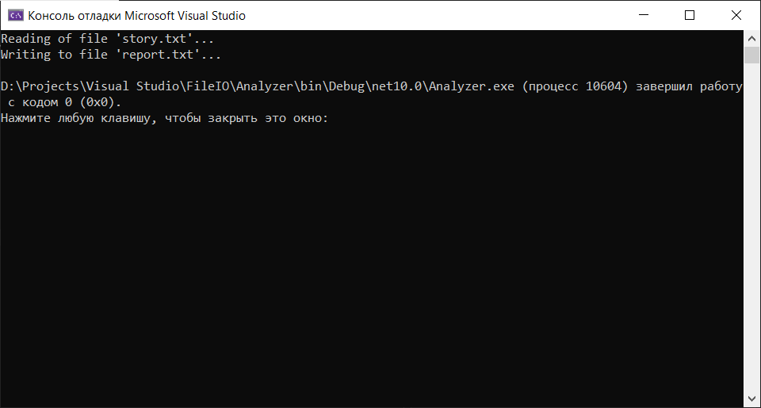
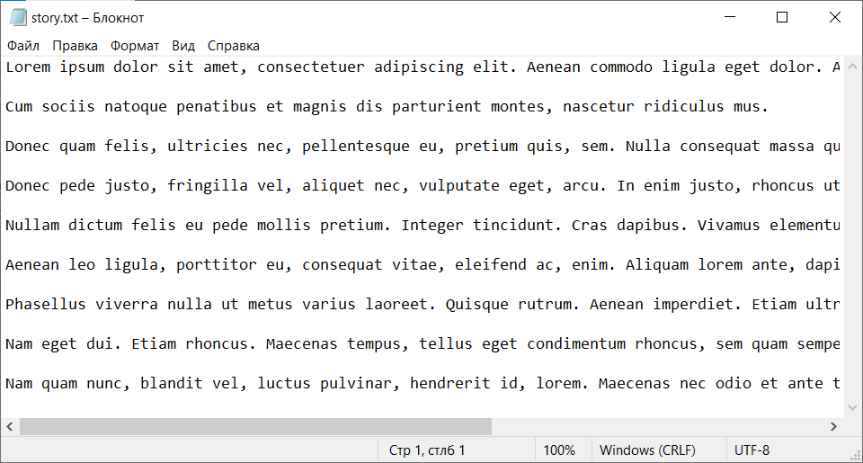
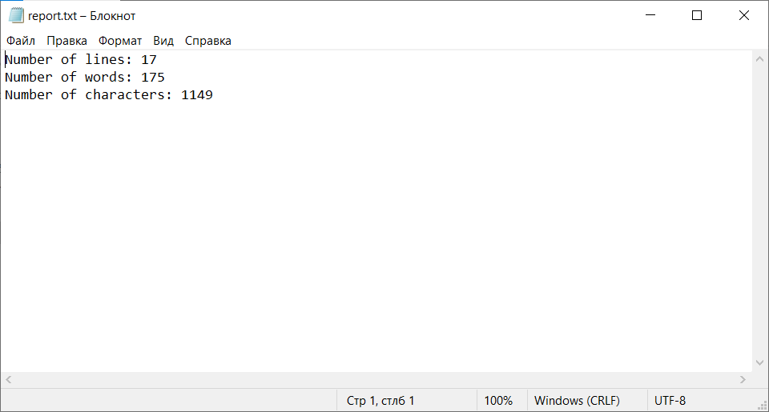
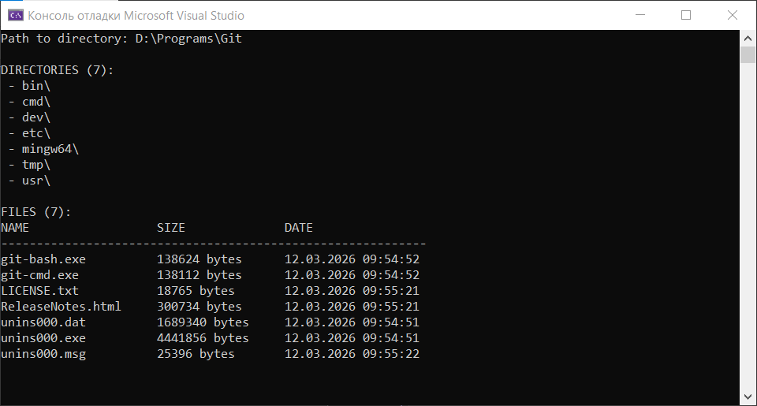
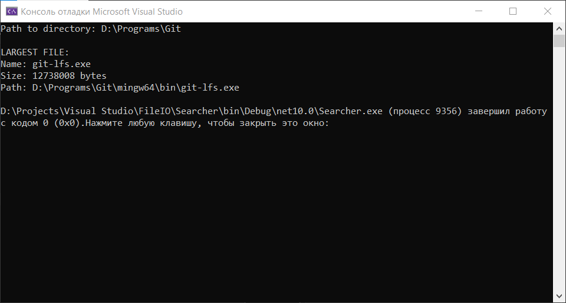
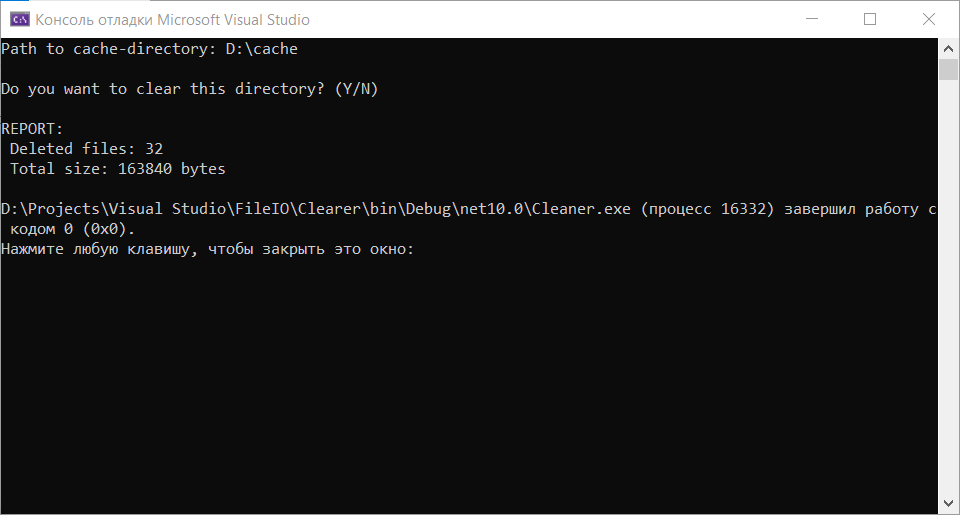
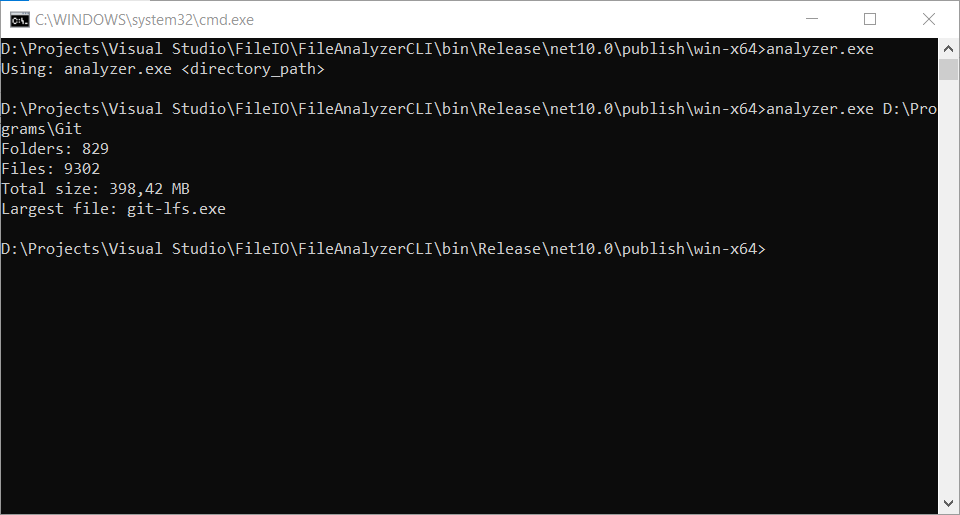

# Практична робота #3

**Курс:** 2\
**Семестр:** 4\
**Виконав:** Негусєв І. В.\
**Група:** ПД-25

# Screenshots:

## Task #1. Analyzer

  

## Task #2. Inspector

## Task #3. Searcher

## Task #4. Cleaner

## Task #5. FileAnalyzerCLI

