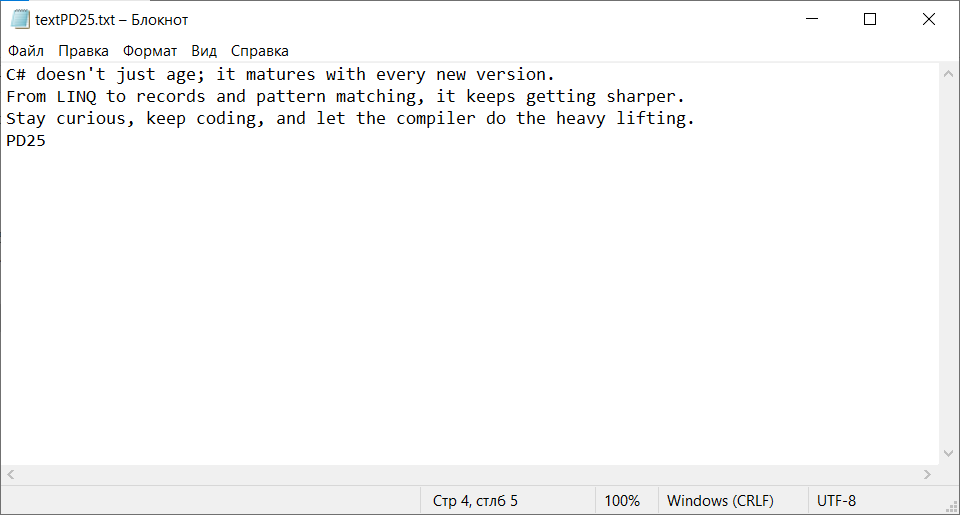
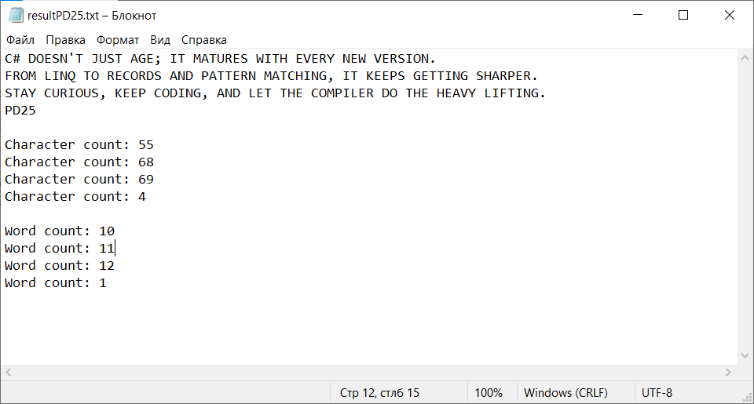
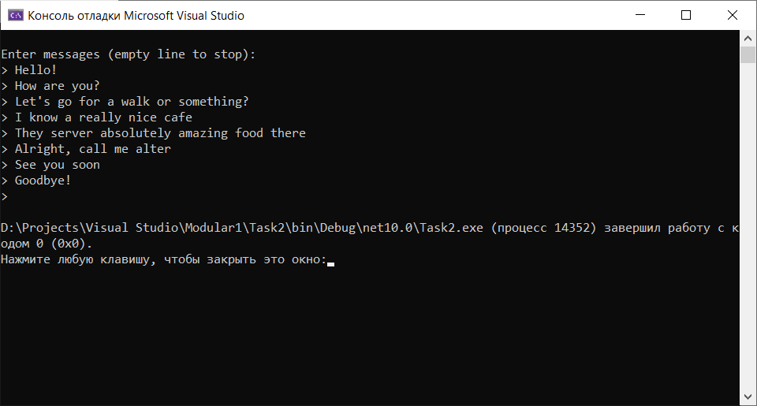
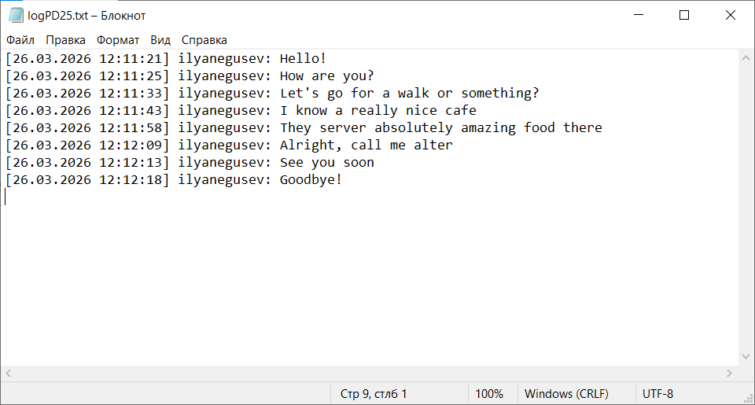

# Модульна робота #1

**Курс:** 2 \
**Семестр:** 4 \
**Виконав:** Негусєв І. В.\
**Група:** ПД-25

# Screenshots:

## Task1

### Input file:

### Output file:

## Task2

### Console view:

### Log file:

