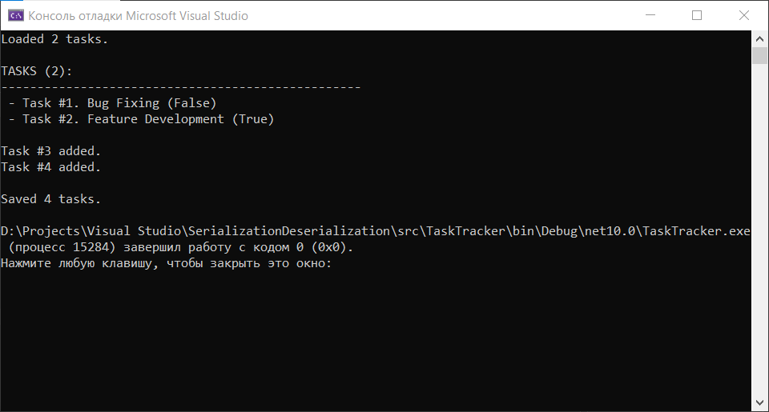
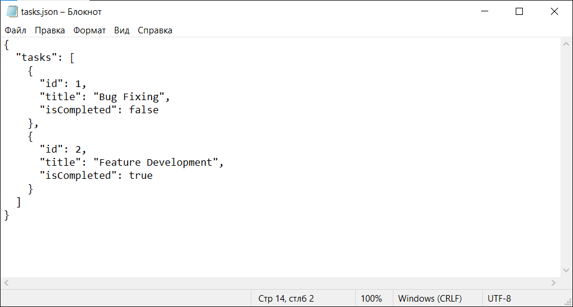
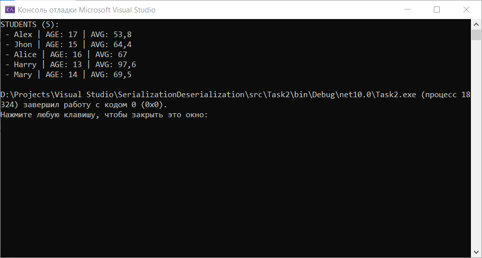
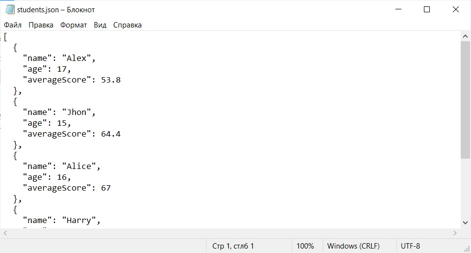
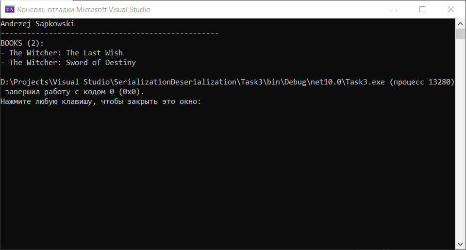
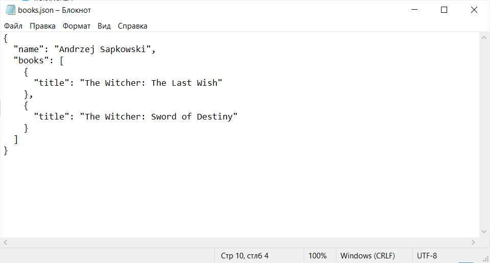
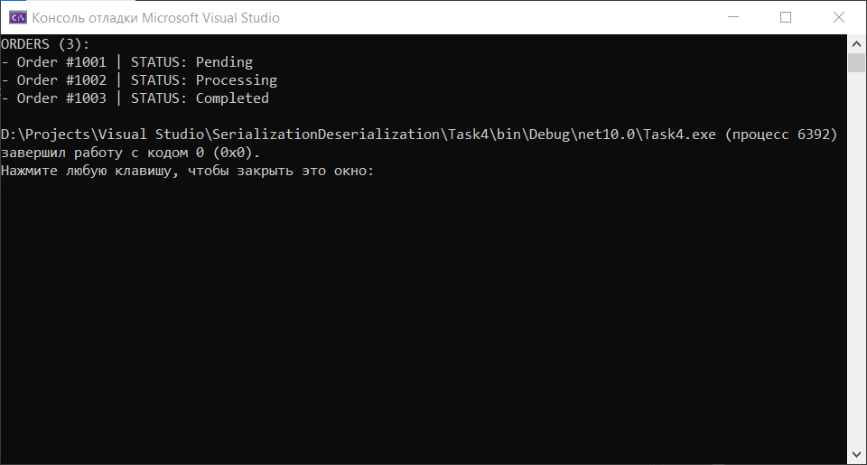
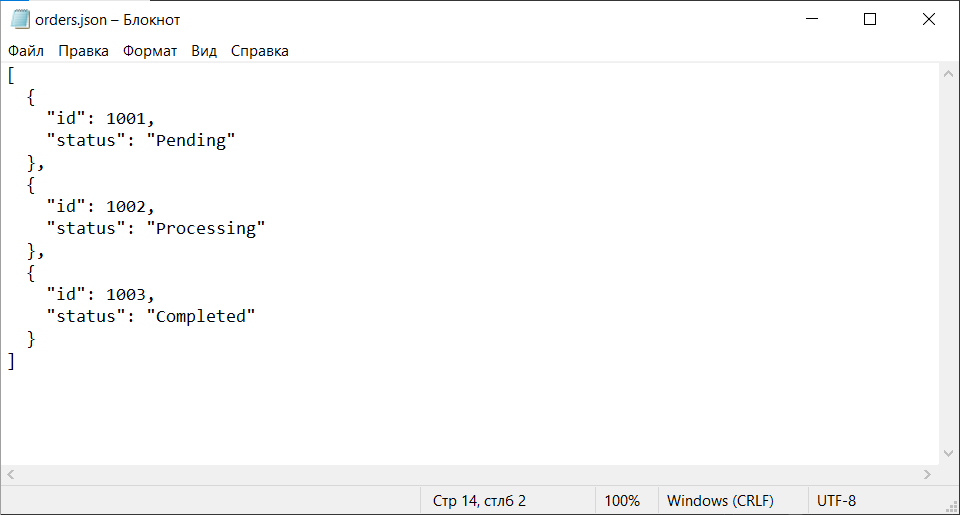

# Практична робота #4

**Курс:** 2\
**Семестр:** 4\
**Виконав:** Негусєв І. В.\
**Група:** ПД-25

# Screenshots:

## Task #1

### First launch:

### Second launch:

### JSON-file:

## Task #2

### Console view:

### JSON-file:

## Task #3

### Console view:

### JSON-file:

## Task #4

### Console view:

### JSON-file:

