# Практична робота #4

**Курс:** 2\
**Семестр:** 4\
**Виконав:** Негусєв І. В.\
**Група:** ПД-25

# Screenshots:

## Task #1

### First launch:

### Second launch:

### JSON-file:

## Task #2

### Console view:

### JSON-file:

## Task #3

### Console view:

### JSON-file:

## Task #4

### Console view:

### JSON-file:

## Task #5

### Console view:

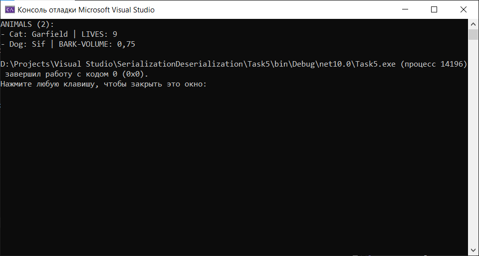

### JSON-file:

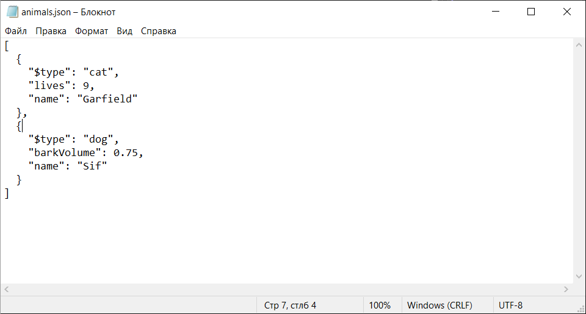

## Task #6

### Before:

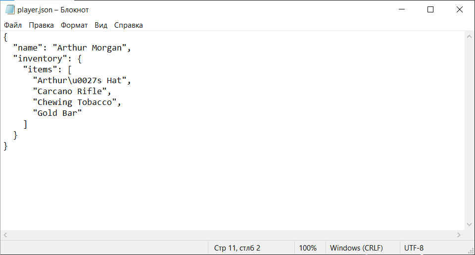

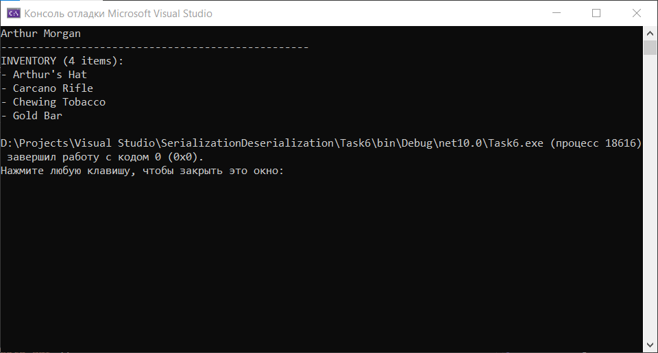

### After:

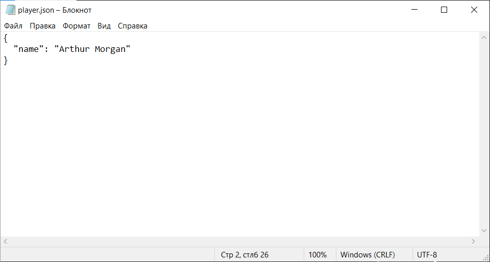

## Task #7

### Latest version:

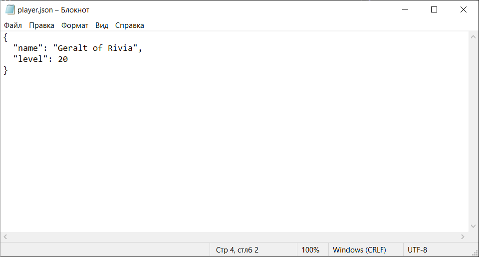

### Previous version:

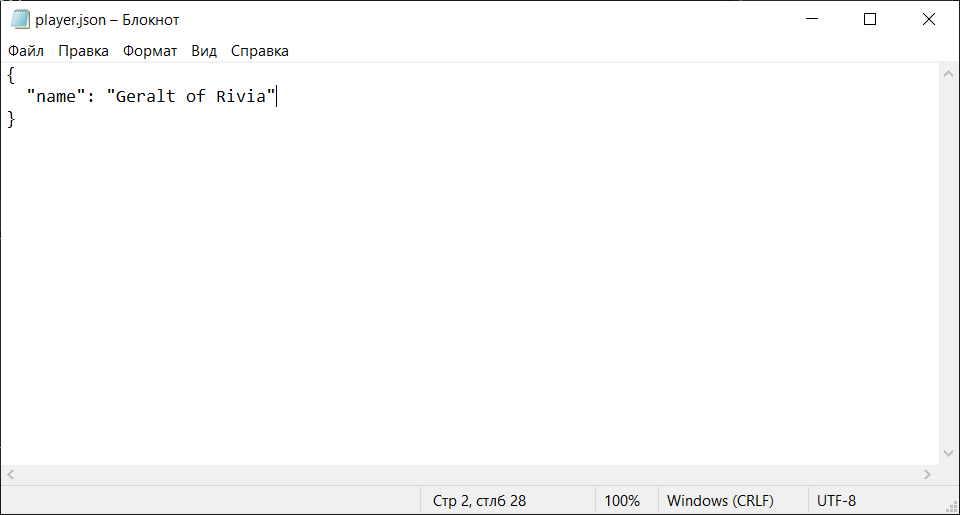

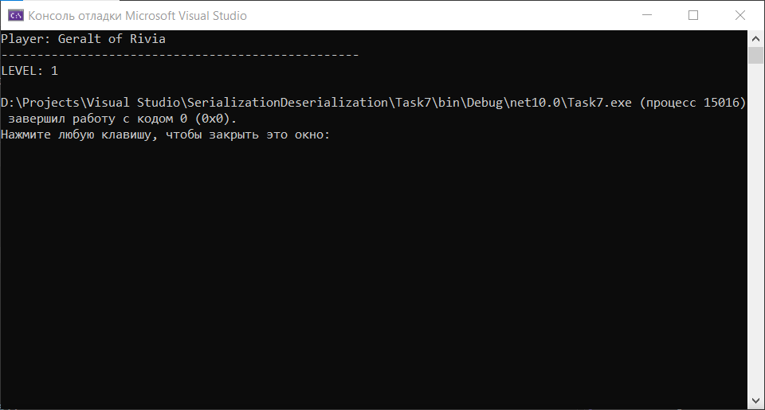

## Task #8

### Working file:

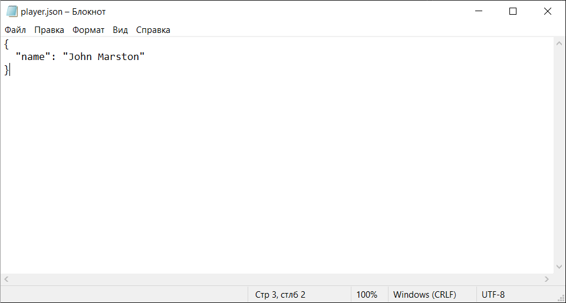

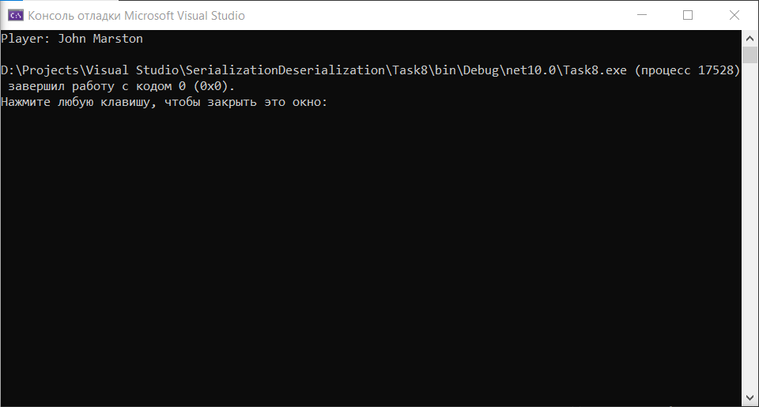

### Corrupted file:

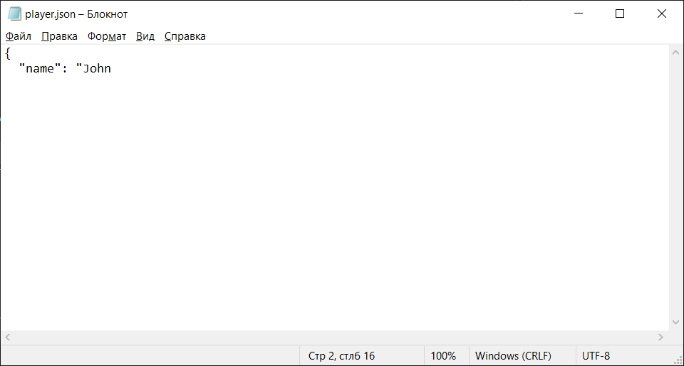

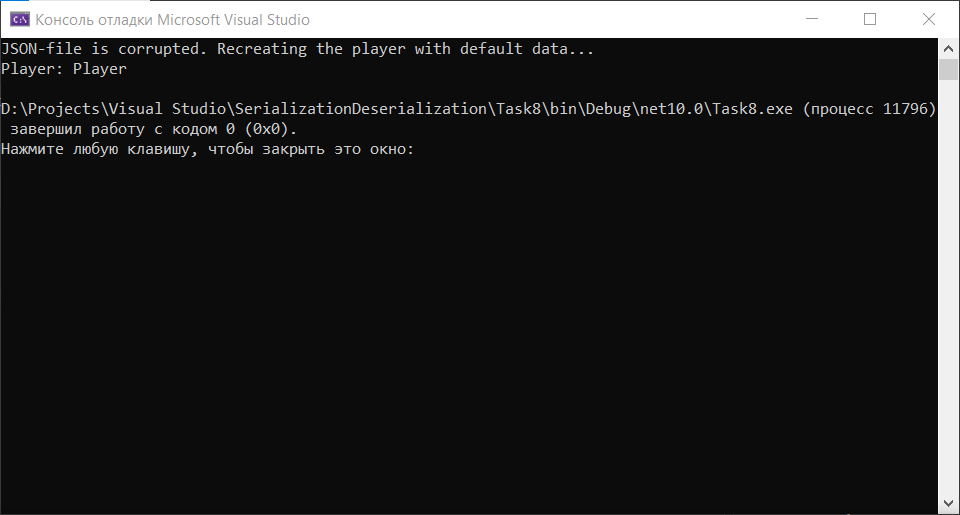
